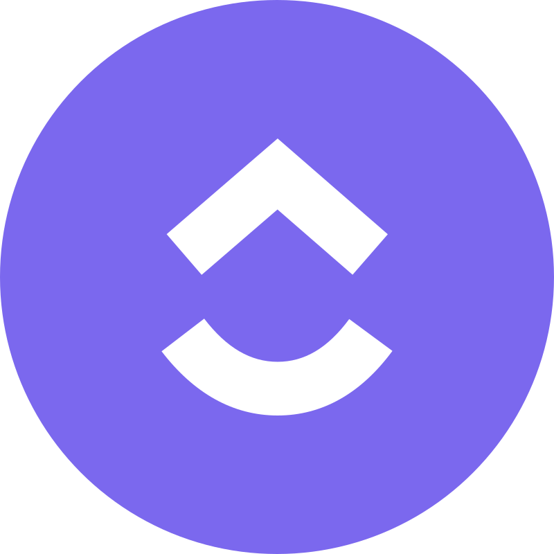

       Hey, I am Roman Grand,
       QA Engineer       

  
  
- 🌱 I completed self-study based on the course materials from <a href="https://qa.studio/" style="color: inherit; text-decoration: none;">QA.Studio</a>

- 💞️ Now, I’m learning basic of QA Automation

- 👣 My credo is "Aut viam inveniam, aut faciam"

 

# Stats 📊

<!-- Выбор темы ↑↑: https://github.com/anuraghazra/github-readme-stats/blob/master/themes/README.md --> 
<!-- Настройка отображения ↑↑: https://github.com/anuraghazra/github-readme-stats/ --> 

<!-- Выбор темы ↑↑: https://github.com/Ashutosh00710/github-readme-activity-graph/blob/main/THEMES.md --> 

 

# My Skills and Tools 💻

## Main

  &nbsp
  &nbsp

## Task Trackers

  &nbsp
  &nbsp
  &nbsp

## Logs

  &nbsp
  &nbsp
  &nbsp
  &nbsp
  <!--
  &nbsp
  -->

## Databases

  &nbsp
  &nbsp
  &nbsp
  &nbsp
  &nbsp

## Integration Testing & API

  &nbsp
  &nbsp
  &nbsp
  &nbsp
  &nbsp

## Web-app & Mobile-app Testing

  &nbsp
  &nbsp
  &nbsp
  &nbsp
  &nbsp
  &nbsp
  &nbsp

## Testing Documentation 
  

    &nbsp
    &nbsp
    &nbsp
  

## Autotests

  &nbsp
  &nbsp
  &nbsp

## Common

  &nbsp
  &nbsp
  &nbsp

<!-- Выбор картинок ↑↑: https://github.com/tandpfun/skill-icons --> 
<!-- Ещё выбор картинок ↑↑: https://github.com/marwin1991/profile-technology-icons/ --> 
 

  &nbsp

# Contact me 

 

